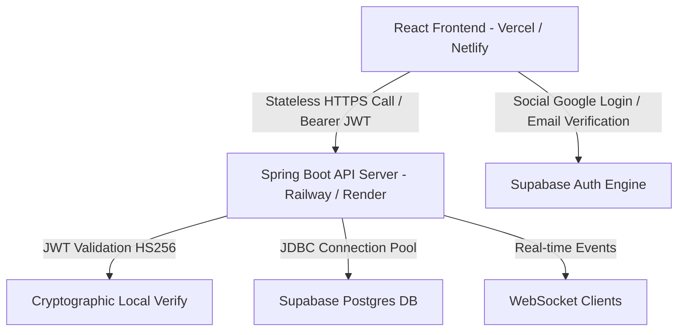

# Matrimonial Backend Architecture & Migration Plan

This document details the enterprise-level production-ready architecture, database schemas, spring boot components, and frontend integration strategies to migrate the **Eternal Bond** platform from a pure-frontend + Supabase client to a scalable, hybrid **React + Spring Boot + Supabase PostgreSQL** architecture.

---

## 1. Architectural Strategy: Auth Comparison & Recommendation

When integrating Spring Boot with an existing React-Supabase application, we choose between two main authentication architectures:

| Criteria | Approach A: Pure Spring Boot JWT Auth | Approach B: Hybrid Auth (Supabase Auth + Spring Boot Logic) |
| :--- | :--- | :--- |
| **User Management** | Fully handled in Spring Boot (custom OAuth2 callbacks, passwords, tables). | Handled by Supabase Auth (Signups, Social OAuth, password reset, MFA). |
| **Complexity** | **High**: Must implement MFA, social providers, token rotation, password hashing, session revocation. | **Low**: Ready out-of-the-box via Supabase dashboard / React SDK. |
| **Security Risk** | High (custom security code increases vulnerability surface). | Low (uses battle-tested GoTrue authentication service). |
| **Data Syncing** | Simple (single database system). | Simple (Supabase profiles sync with Auth triggers). |
| **Scalability** | High (standard stateless JWT architecture). | **Extremely High** (Spring Boot decodes and validates JWTs statelessly without DB hits). |

### The Recommendation: Approach B (Hybrid Auth)
We recommend **Approach B (Hybrid Auth)** for the following reasons:
1. **Stateless Security**: Spring Boot does not need to hit the database to authenticate users. It decodes the JWT issued by Supabase using a shared secret (`JWT_SECRET` via HS256) or JWKS public keys. This cryptographically guarantees user identities instantaneously, achieving maximum throughput.
2. **Reduced Development Cycle**: MFA, Social logins (Google), email validation, and password resets are managed natively on the client using Supabase. The Spring Boot backend simply serves as an authenticated API layer.
3. **No Database Lock-in**: All user profile data resides in the public schema of the Supabase PostgreSQL database, which Spring Boot reads and writes directly using Spring Data JPA.

---

## 2. Directory Structure

### Backend (Spring Boot Maven Application)
```text
eternal-bond-backend/
├── pom.xml
└── src/
    ├── main/
    │   ├── java/
    │   │   └── com/
    │   │       └── eternalbond/
    │   │           └── api/
    │   │               ├── EternalBondApplication.java
    │   │               ├── config/
    │   │               │   ├── SecurityConfig.java          # Spring Security, CORS & JWT filters
    │   │               │   ├── WebSocketConfig.java         # STOMP / WebSocket messaging configuration
    │   │               │   └── RedisConfig.java             # Cache and rate limiter setup
    │   │               ├── controller/
    │   │               │   ├── SwipeController.java         # Matching & swiping REST controller
    │   │               │   ├── ChatController.java          # Chat & WebSockets controller
    │   │               │   ├── ProfileController.java       # Profile updates & privacy management
    │   │               │   └── FamilyController.java        # Guardian invite and approval flows
    │   │               ├── dto/
    │   │               │   ├── SwipeRequest.java
    │   │               │   ├── ProfileDto.java
    │   │               │   └── MessageDto.java
    │   │               ├── exception/
    │   │               │   ├── GlobalExceptionHandler.java  # Controller advice for clean errors
    │   │               │   └── ResourceNotFoundException.java
    │   │               ├── filter/
    │   │               │   └── SupabaseJwtFilter.java       # Custom JWT parsing & signature validation
    │   │               ├── model/
    │   │               │   ├── Profile.java                 # JPA Entity mapping public.profiles
    │   │               │   ├── Match.java                   # JPA Entity mapping public.matches
    │   │               │   ├── Message.java                 # JPA Entity mapping public.messages
    │   │               │   ├── FamilyInvolvement.java       # JPA Entity mapping public.family_members
    │   │               │   └── Subscription.java            # JPA Entity mapping public.subscriptions
    │   │               ├── repository/
    │   │               │   ├── ProfileRepository.java
    │   │               │   ├── MatchRepository.java
    │   │               │   └── MessageRepository.java
    │   │               └── service/
    │   │                   ├── SwipeService.java
    │   │                   ├── ChatService.java
    │   │                   ├── ProfileService.java
    │   │                   └── MediaUploadService.java      # Connects directly to Supabase S3 buckets
    │   └── resources/
    │       ├── application.properties
    │       └── application-prod.properties
```

### Frontend (React / Vite / TypeScript)
```text
eternal-bond-landing/
├── src/
│   ├── api/
│   │   ├── client.ts              # Axios client configured with JWT auto-inject & retry
│   │   ├── auth.ts                # Spring Boot REST api calls
│   │   ├── matches.ts             # React Query API bindings
│   │   └── chat.ts
│   ├── components/
│   │   ├── auth/
│   │   │   └── RequireAuth.tsx    # Hook to intercept JWT expired states and auto-refresh
│   │   └── chat/
│   │       └── ChatWindow.tsx     # WebSocket STOMP listener integration
```

---

## 3. Database Schema Design (PostgreSQL Migrations)

Below is the database schema configured in Supabase. It supports matching, KYC verification, family guardian boundaries, premium billing, and privacy controls.

```sql
-- 1. Matrimonial Enums
CREATE TYPE public.swipe_action AS ENUM ('like', 'dislike');
CREATE TYPE public.guardian_role AS ENUM ('father', 'mother', 'sibling', 'uncle', 'aunt', 'other');
CREATE TYPE public.privacy_level AS ENUM ('everyone', 'verified_only', 'matches_only', 'premium_only');

-- 2. Profiles Extensions (Matrimonial specifications)
ALTER TABLE public.profiles
  ADD COLUMN IF NOT EXISTS kyc_status public.kyc_status NOT NULL DEFAULT 'unverified',
  ADD COLUMN IF NOT EXISTS photo_visibility public.privacy_level NOT NULL DEFAULT 'everyone',
  ADD COLUMN IF NOT EXISTS profile_visibility public.privacy_level NOT NULL DEFAULT 'everyone';

-- 3. Matches Table
CREATE TABLE public.matches (
  id uuid PRIMARY KEY DEFAULT gen_random_uuid(),
  user_one_id uuid REFERENCES public.profiles(id) ON DELETE CASCADE NOT NULL,
  user_two_id uuid REFERENCES public.profiles(id) ON DELETE CASCADE NOT NULL,
  created_at timestamptz NOT NULL DEFAULT now(),
  CONSTRAINT unique_match_pair UNIQUE (user_one_id, user_two_id),
  CONSTRAINT match_id_order CHECK (user_one_id < user_two_id)
);

-- 4. Swipes Table (For matching logs)
CREATE TABLE public.swipes (
  id uuid PRIMARY KEY DEFAULT gen_random_uuid(),
  swiper_id uuid REFERENCES public.profiles(id) ON DELETE CASCADE NOT NULL,
  swiped_id uuid REFERENCES public.profiles(id) ON DELETE CASCADE NOT NULL,
  action public.swipe_action NOT NULL,
  created_at timestamptz NOT NULL DEFAULT now(),
  CONSTRAINT unique_swipe UNIQUE (swiper_id, swiped_id)
);

-- 5. Family Involvement / Guardians
CREATE TABLE public.family_members (
  id uuid PRIMARY KEY DEFAULT gen_random_uuid(),
  user_id uuid REFERENCES public.profiles(id) ON DELETE CASCADE NOT NULL,
  guardian_email text NOT NULL,
  guardian_phone text,
  relationship public.guardian_role NOT NULL,
  is_approved boolean NOT NULL DEFAULT false,
  can_veto_matches boolean NOT NULL DEFAULT false,
  created_at timestamptz NOT NULL DEFAULT now(),
  CONSTRAINT unique_guardian_per_user UNIQUE (user_id, guardian_email)
);

-- 6. Real-time Messages
CREATE TABLE public.messages (
  id uuid PRIMARY KEY DEFAULT gen_random_uuid(),
  match_id uuid REFERENCES public.matches(id) ON DELETE CASCADE NOT NULL,
  sender_id uuid REFERENCES public.profiles(id) ON DELETE CASCADE NOT NULL,
  content text NOT NULL,
  is_read boolean NOT NULL DEFAULT false,
  created_at timestamptz NOT NULL DEFAULT now()
);

-- 7. Subscriptions (Premium Plans)
CREATE TABLE public.subscriptions (
  id uuid PRIMARY KEY DEFAULT gen_random_uuid(),
  user_id uuid REFERENCES public.profiles(id) ON DELETE CASCADE NOT NULL,
  stripe_subscription_id text UNIQUE,
  status text NOT NULL, -- 'active', 'canceled', 'past_due'
  tier text NOT NULL,   -- 'silver', 'gold', 'platinum'
  expires_at timestamptz NOT NULL,
  created_at timestamptz NOT NULL DEFAULT now()
);

-- Indexes for performance & scalable searches
CREATE INDEX idx_profiles_visibility ON public.profiles(profile_visibility, kyc_status);
CREATE INDEX idx_swipes_swiper ON public.swipes(swiper_id, action);
CREATE INDEX idx_messages_match ON public.messages(match_id, created_at DESC);
```

---

## 4. Spring Boot Implementation Code Snippets

### A. Environment Configuration (`application.properties`)
Store sensitive production credentials safely. Do not hardcode secrets.

```properties
# Spring Datasource (Directly connects to Supabase database transaction pooler)
spring.datasource.url=jdbc:postgresql://${SUPABASE_DB_HOST}:5432/postgres?sslmode=require
spring.datasource.username=${SUPABASE_DB_USER}
spring.datasource.password=${SUPABASE_DB_PASSWORD}
spring.datasource.driver-class-name=org.postgresql.Driver

# JPA Config
spring.jpa.hibernate.ddl-auto=validate
spring.jpa.show-sql=false
spring.jpa.properties.hibernate.dialect=org.hibernate.dialect.PostgreSQLDialect

# Supabase JWT Shared Secret (Retrieve from Supabase Dashboard -> API settings)
supabase.jwt.secret=${SUPABASE_JWT_SECRET}
```

### B. JPA Entity Models

#### Profile Entity
```java
package com.eternalbond.api.model;

import lombok.*;
import jakarta.persistence.*;
import java.time.LocalDate;
import java.time.LocalDateTime;

@Entity
@Table(name = "profiles", schema = "public")
@Getter
@Setter
@NoArgsConstructor
@AllArgsConstructor
public class Profile {
    @Id
    private String id; // Maps directly to Supabase User UUID string

    @Column(name = "full_name")
    private String fullName;

    private String email;

    @Column(name = "profile_completed")
    private boolean profileCompleted;

    @Enumerated(EnumType.STRING)
    @Column(name = "kyc_status")
    private KycStatus kycStatus;

    @Enumerated(EnumType.STRING)
    @Column(name = "photo_visibility")
    private PrivacyLevel photoVisibility;

    @Enumerated(EnumType.STRING)
    @Column(name = "profile_visibility")
    private PrivacyLevel profileVisibility;

    public enum KycStatus { unverified, pending, verified, rejected }
    public enum PrivacyLevel { everyone, verified_only, matches_only, premium_only }
}
```

#### Match Entity
```java
package com.eternalbond.api.model;

import lombok.*;
import jakarta.persistence.*;
import java.time.LocalDateTime;

@Entity
@Table(name = "matches", schema = "public")
@Getter
@Setter
@NoArgsConstructor
@AllArgsConstructor
public class Match {
    @Id
    @GeneratedValue(strategy = GenerationType.UUID)
    private String id;

    @ManyToOne(fetch = FetchType.LAZY)
    @JoinColumn(name = "user_one_id", nullable = false)
    private Profile userOne;

    @ManyToOne(fetch = FetchType.LAZY)
    @JoinColumn(name = "user_two_id", nullable = false)
    private Profile userTwo;

    @Column(name = "created_at", nullable = false, updatable = false)
    private LocalDateTime createdAt = LocalDateTime.now();
}
```

### C. Supabase JWT Filter & Spring Security Configuration

This component intercepts requests, decodes the HS256 JWT generated by Supabase using the local `SUPABASE_JWT_SECRET`, and populates Spring Security's context.

#### JWT Filter
```java
package com.eternalbond.api.filter;

import io.jsonwebtoken.Claims;
import io.jsonwebtoken.Jwts;
import io.jsonwebtoken.security.Keys;
import jakarta.servlet.FilterChain;
import jakarta.servlet.ServletException;
import jakarta.servlet.http.HttpServletRequest;
import jakarta.servlet.http.HttpServletResponse;
import org.springframework.beans.factory.annotation.Value;
import org.springframework.security.authentication.UsernamePasswordAuthenticationToken;
import org.springframework.security.core.context.SecurityContextHolder;
import org.springframework.stereotype.Component;
import org.springframework.web.filter.OncePerRequestFilter;

import java.io.IOException;
import java.nio.charset.StandardCharsets;
import java.util.Collections;

@Component
public class SupabaseJwtFilter extends OncePerRequestFilter {

    @Value("${supabase.jwt.secret}")
    private String jwtSecret;

    @Override
    protected void doFilterInternal(HttpServletRequest request, HttpServletResponse response, FilterChain filterChain)
            throws ServletException, IOException {
        String authHeader = request.getHeader("Authorization");

        if (authHeader != null && authHeader.startsWith("Bearer ")) {
            String token = authHeader.substring(7);
            try {
                // Parse JWT using shared Supabase JWT Secret
                Claims claims = Jwts.parserBuilder()
                        .setSigningKey(Keys.hmacShaKeyFor(jwtSecret.getBytes(StandardCharsets.UTF_8)))
                        .build()
                        .parseClaimsJws(token)
                        .getBody();

                String userId = claims.getSubject(); // User ID (UUID) is mapped to 'sub' claim

                if (userId != null) {
                    UsernamePasswordAuthenticationToken auth = new UsernamePasswordAuthenticationToken(
                            userId, null, Collections.emptyList());
                    SecurityContextHolder.getContext().setAuthentication(auth);
                }
            } catch (Exception e) {
                // Invalid token - clear context
                SecurityContextHolder.clearContext();
            }
        }
        filterChain.doFilter(request, response);
    }
}
```

#### Security Configuration
```java
package com.eternalbond.api.config;

import com.eternalbond.api.filter.SupabaseJwtFilter;
import org.springframework.context.annotation.Bean;
import org.springframework.context.annotation.Configuration;
import org.springframework.security.config.annotation.web.builders.HttpSecurity;
import org.springframework.security.config.annotation.web.configuration.EnableWebSecurity;
import org.springframework.security.config.http.SessionCreationPolicy;
import org.springframework.security.web.SecurityFilterChain;
import org.springframework.security.web.authentication.UsernamePasswordAuthenticationFilter;
import org.springframework.web.cors.CorsConfiguration;
import org.springframework.web.cors.CorsConfigurationSource;
import org.springframework.web.cors.UrlBasedCorsConfigurationSource;

import java.util.Arrays;
import java.util.List;

@Configuration
@EnableWebSecurity
public class SecurityConfig {

    private final SupabaseJwtFilter jwtFilter;

    public SecurityConfig(SupabaseJwtFilter jwtFilter) {
        this.jwtFilter = jwtFilter;
    }

    @Bean
    public SecurityFilterChain securityFilterChain(HttpSecurity http) throws Exception {
        http
            .cors().configurationSource(corsConfigurationSource()).and()
            .csrf().disable()
            .sessionManagement().sessionCreationPolicy(SessionCreationPolicy.STATELESS).and()
            .authorizeHttpRequests(auth -> auth
                .requestMatchers("/api/public/**", "/ws/**").permitAll()
                .anyRequest().authenticated()
            )
            .addFilterBefore(jwtFilter, UsernamePasswordAuthenticationFilter.class);

        return http.build();
    }

    @Bean
    public CorsConfigurationSource corsConfigurationSource() {
        CorsConfiguration config = new CorsConfiguration();
        config.setAllowedOriginPatterns(List.of("*")); // Restrict to front-end domain in production
        config.setAllowedMethods(Arrays.asList("GET", "POST", "PUT", "DELETE", "OPTIONS"));
        config.setAllowedHeaders(Arrays.asList("Authorization", "Content-Type"));
        config.setAllowCredentials(true);
        UrlBasedCorsConfigurationSource source = new UrlBasedCorsConfigurationSource();
        source.registerCorsConfiguration("/**", config);
        return source;
    }
}
```

### D. WebSocket Chat Controller Configuration

Configured for scalable state propagation to clients on a custom Spring Boot WebSocket Broker.

#### WebSocket Configuration
```java
package com.eternalbond.api.config;

import org.springframework.context.annotation.Configuration;
import org.springframework.messaging.simp.config.MessageBrokerRegistry;
import org.springframework.web.socket.config.annotation.EnableWebSocketMessageBroker;
import org.springframework.web.socket.config.annotation.StompEndpointRegistry;
import org.springframework.web.socket.config.annotation.WebSocketMessageBrokerConfigurer;

@Configuration
@EnableWebSocketMessageBroker
public class WebSocketConfig implements WebSocketMessageBrokerConfigurer {

    @Override
    public void configureMessageBroker(MessageBrokerRegistry registry) {
        registry.enableSimpleBroker("/queue", "/topic"); // Outbound destinations
        registry.setApplicationDestinationPrefixes("/app"); // Inbound destinations
    }

    @Override
    public void registerStompEndpoints(StompEndpointRegistry registry) {
        registry.addStompEndpoint("/ws")
                .setAllowedOriginPatterns("*")
                .withSockJS(); // Fallback for browsers
    }
}
```

#### Chat Messaging Controller
```java
package com.eternalbond.api.controller;

import com.eternalbond.api.dto.MessageDto;
import org.springframework.messaging.handler.annotation.DestinationVariable;
import org.springframework.messaging.handler.annotation.MessageMapping;
import org.springframework.messaging.simp.SimpMessagingTemplate;
import org.springframework.stereotype.Controller;

@Controller
public class ChatController {

    private final SimpMessagingTemplate messagingTemplate;

    public ChatController(SimpMessagingTemplate messagingTemplate) {
        this.messagingTemplate = messagingTemplate;
    }

    @MessageMapping("/chat/{matchId}")
    public void sendDirectMessage(@DestinationVariable String matchId, MessageDto message) {
        // Business logic: save message into Database using MessageRepository
        // ...
        
        // Push payload real-time to active match channel subscriber
        messagingTemplate.convertAndSend("/queue/messages/" + matchId, message);
    }
}
```

---

## 5. Matrimonial-Specific Backend Features Design

### Swipes and Match Service
When a swipe occurs, we check if the recipient already swiped 'like' on the current user. If yes, we dynamically instantiate a Match transaction.

```java
package com.eternalbond.api.service;

import com.eternalbond.api.model.*;
import com.eternalbond.api.repository.*;
import org.springframework.stereotype.Service;
import org.springframework.transaction.annotation.Transactional;

@Service
public class SwipeService {
    private final SwipeRepository swipeRepository;
    private final MatchRepository matchRepository;

    public SwipeService(SwipeRepository swipeRepository, MatchRepository matchRepository) {
        this.swipeRepository = swipeRepository;
        this.matchRepository = matchRepository;
    }

    @Transactional
    public boolean processSwipe(String swiperId, String swipedId, String action) {
        // Save swipe action
        // ...
        
        if ("like".equalsIgnoreCase(action)) {
            // Check if reverse swipe exists
            boolean hasLikedBack = swipeRepository.existsBySwiperIdAndSwipedIdAndAction(
                    swipedId, swiperId, SwipeAction.like);
            
            if (hasLikedBack) {
                // Instantiate Mutual Match
                Match match = new Match();
                Profile userOne = new Profile(); userOne.setId(swiperId.compareTo(swipedId) < 0 ? swiperId : swipedId);
                Profile userTwo = new Profile(); userTwo.setId(swiperId.compareTo(swipedId) < 0 ? swipedId : swiperId);
                match.setUserOne(userOne);
                match.setUserTwo(userTwo);
                matchRepository.save(match);
                return true; // Match Celebrated
            }
        }
        return false;
    }
}
```

### Privacy-focused Visibility Enforcement
When serving profile queries, Spring Boot checks the viewing user's permissions:

```java
public boolean canViewProfilePhotos(Profile target, Profile viewer, boolean isMatch) {
    if (target.getPhotoVisibility() == PrivacyLevel.everyone) return true;
    if (target.getPhotoVisibility() == PrivacyLevel.verified_only && viewer.getKycStatus() == KycStatus.verified) return true;
    if (target.getPhotoVisibility() == PrivacyLevel.matches_only && isMatch) return true;
    return false; // Otherwise redact photos from DTO
}
```

---

## 6. Frontend React Integration & Axios Configuration

The frontend must authenticate client calls statelessly. Below is the custom Axios Client module implementing auto-inject headers and token verification hooks.

### Axios Client configuration (`src/api/client.ts`)
```typescript
import axios from "axios";
import { supabase } from "@/integrations/supabase/client";

export const api = axios.create({
  baseURL: import.meta.env.VITE_SPRING_BOOT_API_URL || "http://localhost:8080/api",
  headers: {
    "Content-Type": "application/json",
  },
});

// Interceptor: inject active Supabase JWT into every API request header dynamically
api.interceptors.request.use(async (config) => {
  const { data: { session } } = await supabase.auth.getSession();
  if (session?.access_token) {
    config.headers.Authorization = `Bearer ${session.access_token}`;
  }
  return config;
}, (error) => {
  return Promise.reject(error);
});

// Auto-refresh token strategy:
// Supabase Client handles JWT refresh in the background automatically.
// If the Spring Boot backend returns a 401 (token expired/invalid), we force a session refresh via Supabase and retry.
api.interceptors.response.use(
  (response) => response,
  async (error) => {
    const originalRequest = error.config;
    if (error.response?.status === 401 && !originalRequest._retry) {
      originalRequest._retry = true;
      // Force Supabase Auth to refresh session tokens
      const { data, error: refreshError } = await supabase.auth.refreshSession();
      if (!refreshError && data.session) {
        originalRequest.headers.Authorization = `Bearer ${data.session.access_token}`;
        return api(originalRequest); // Retry request with fresh JWT
      }
    }
    return Promise.reject(error);
  }
);
```

### Using React Query with Custom API
```typescript
import { useQuery, useMutation, useQueryClient } from "@tanstack/react-query";
import { api } from "./client";

export const useDailyMatches = () => {
  return useQuery({
    queryKey: ["dailyMatches"],
    queryFn: async () => {
      const response = await api.get("/matches/daily");
      return response.data;
    },
  });
};

export const useSwipeMutation = () => {
  const queryClient = useQueryClient();
  return useMutation({
    mutationFn: async ({ profileId, action }: { profileId: string; action: "like" | "dislike" }) => {
      const response = await api.post("/swipes", { profileId, action });
      return response.data;
    },
    onSuccess: () => {
      // Invalidate queries to fetch fresh recommendations
      queryClient.invalidateQueries({ queryKey: ["dailyMatches"] });
    },
  });
};
```

---

## 7. Deployment Architecture Blueprint



### Infrastructure Specs
1. **Frontend**: Hosted on **Vercel** or **Netlify** for high edge performance and global CDN caching. Redirect routes point back to the app domains.
2. **Backend Application**: Hosted on **Railway**, **Render**, or a dedicated **Docker VPS** (configured with auto-deploy pipelines tracking GitHub branches). 
3. **Database**: Hosted on **Supabase**. Direct JDBC connection parameters are established using Supabase’s transaction pooler link (port `5432` or pooled transaction-level port `6543`).

---

## 8. Step-by-Step Migration Plan

1. **Step 1: Database Baseline Mapping**
   - Extract raw table schemas from Supabase migrations and configure corresponding Java JPA `@Entity` classes on Spring Boot. Ensure fields, enums, and data properties match exactly.
2. **Step 2: Security Integration**
   - Configure Spring Security with standard filters and implement the `SupabaseJwtFilter`. Get the shared JWT Secret (`SUPABASE_JWT_SECRET`) from API settings inside the Supabase Console.
3. **Step 3: Business Logic Migration**
   - Translate matching queries, profile completions, and message histories from client-side callbacks into backend Services and Controller mappings.
4. **Step 4: Real-time Communication Bridge**
   - Set up Spring Boot WebSocket brokers using STOMP. Replace frontend-driven Supabase Subscription listeners with WebSocket streams routing messaging logs straight into Spring Boot.
5. **Step 5: Frontend API Integration**
   - Set up the configured Axios Client `client.ts` file in the React project and switch pages from accessing `.from("table")` client functions to matching Axios REST end-points.
6. **Step 6: Production Staging & Validation**
   - Deploy backend to Railway/Render staging environment. Connect to database copy, run integration builds, verify security rules, and test Google social logins end-to-end before updating production configuration.
